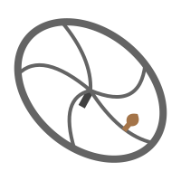

<div align="center">
  <h1>Manivelle</h1>
  
  <p>A very small, streaming friendly template engine ⚙️</p>
</div>

---

Manivelle (french for handcrank) is a template engine with first class support for streaming.
It's also:
- Very small, ~110 lines of code.
- Pure Javascript, no build or compilation step required.
- Standalone, has no dependencies.
- Safe, sanitize html by default.

## Usage

> [examples/readme.js](examples/readme.js)

```js
import { html } from "manivelle"

function render(tasks) {
  return html`
    <title>My Todo List</title>
    <meta charset="utf-8">
    ${renderList}
  `;

  async function* renderList() {
    if (tasks.length === 0) {
      yield html`<p>All caught up!</p>`;
    } else {
      yield html`<ul>`;
      for (const task of tasks) {
        yield html`<li>${task}</li>`;
      }
      yield html`</ul>`;
    }
  }
}

const result = render(["Clean the house", "Water the plants"]);

for await (const value of result) {
  console.log(String(value));
}
```

# License

MIT (c) David De Jesus Duarte